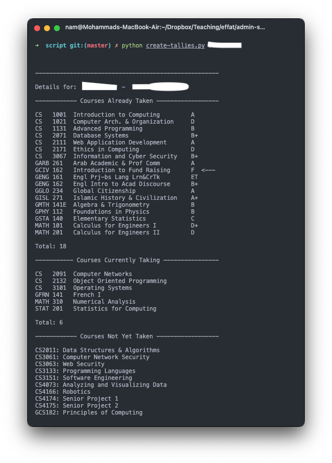

Effat Banner Parser for Tallies 

Install requirements through `pip install lxml pyyaml` 

Setup your banner username and password in `settings.py`

Add all offered courses for the next semester in `courses.txt` (one course per line)

Add Student IDs of users (S1111122222 format) in `ids.txt` (one ID per line) 

Run the banner parser through `python banner-transcript.py ids.txt`

Once done, parse the transcripts to get combined csv using: `python parse-transcript.py ids.txt` 

Finally, get details of an individual student using `python create-tallies.py S11112222`. 

Perform the final step for each individual separately. 

